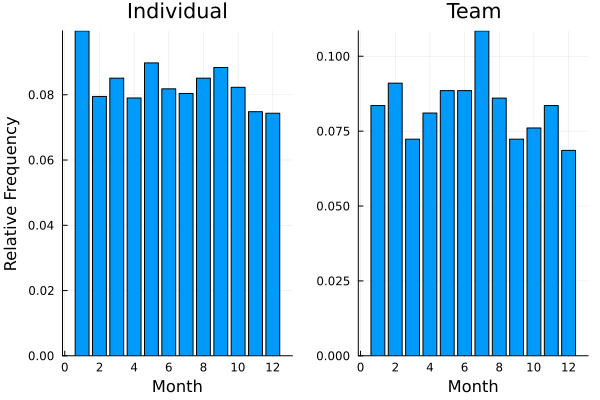

# Data Jamboree 2024
Julia code for the ASA computing section mini-symposium data jamboree. 

## Intro
Full disclosure, this was my first time webscrapping in `Julia`, so I'm sure that my solution could be a little more elegant, though webscrapping concepts are pretty consistent across languages.
In this demo - we deal with two different types of websites, dynamic and static.
For dynamic sites we need a web driver in order to interact with the website through code.
This allows the different scripts on the website to run from which we can then scrap the compiled html. 

In `Julia` we have two options of packages: `Blink` which is a wrapper for `Electron` and can communicate to the browser through `JavaScript`.
I was not able to get the [olympics](https://olympics.com/en/paris-2024/athletes/artistic-gymnastics) website to load in Blink and other websites worked did load so I did not spend too much time messing with with the package.
Additionally, for `Blink` you are passing `JavaScript` code which is a little more complicated than using the wrapper functions from other web driver packages (though may be easier if you are familiar with `JavaScript`).

The second option is `WebDriver`, a wrapper for `Selenium` and should be very familiar to those who have used the `webdriver` package in `Python`[^1]. 
This is the package that I use in the demo. 
[The documentation](https://nosferican.github.io/WebDriver.jl/dev/) is rather sparse, but there is a nice tutorial for web automation using `WebDriver` in julia [here](https://www.youtube.com/watch?v=KWYNlIOxQpo).
While `WebDriver` accomplishes everything we need for this demo, the package is more lightweight than the correpsonding `Python` package.
Using the `WebDriver` package requires a web driver application and following the linked tutorial, I also use `chromedriver`, but you can select a different web driver if you prefer.

For static websites we use the `HTTP` package to scrap the html, `Gumbo` to parse the html into a structured object which can then be easily indexed by the tree structure of the html code.
Lastly, the `Cascadia` package can extract elements from the html using css selectors.
[Here](https://www.youtube.com/watch?v=qv7M5oBZPWE) is a tutorial for these three packages. 

[^1]:
  The is also another `WebDriver` package out there which is deprecated. Some tutorials on YouTube use this older package which has different functions.

## Getting Started
In the chunk below 
```julia
using Pkg

Pkg.activate(@__DIR__)
Pkg.instantiate()
```

```julia
using HTTP, Gumbo, Cascadia
using WebDriver, DefaultApplication
using ProgressBars
using DataFrames, CSV, PrettyTables
using Plots, StatsPlots
using StatsBase
```


```julia; results = "hidden"
df = CSV.read("athlete_df.csv", DataFrame)
```


```julia
df[:,:sport_type] = ifelse.(df.sport .∈ (["football", "volleyball", "basketball"],), "team", "individual")
filter!(:month => !=(0), df)

ind = combine(groupby(df[df.sport_type .== "individual",:], :month), nrow => :count)
team = combine(groupby(df[df.sport_type .== "team",:], :month), nrow => :count)

ind.rel_freq = ind.count ./ sum(ind.count)
team.rel_freq = team.count ./ sum(team.count)

both = innerjoin(ind, team, on=:month, makeunique=true)
select!(both,[:month, :rel_freq, :rel_freq_1])
rename!(both, ["Month", "Individual", "Team"])

pretty_table(both, backend=Val(:markdown), formatters=ft_printf("%5.3f", [2,3]))
```
| **Month**<br>`Int64` | **Individual**<br>`Float64` | **Team**<br>`Float64` |
|---------------------:|----------------------------:|----------------------:|
| 1                    | 0.100                       | 0.084                 |
| 2                    | 0.079                       | 0.091                 |
| 3                    | 0.085                       | 0.072                 |
| 4                    | 0.079                       | 0.081                 |
| 5                    | 0.090                       | 0.089                 |
| 6                    | 0.082                       | 0.089                 |
| 7                    | 0.080                       | 0.108                 |
| 8                    | 0.085                       | 0.086                 |
| 9                    | 0.088                       | 0.072                 |
| 10                   | 0.082                       | 0.076                 |
| 11                   | 0.075                       | 0.084                 |
| 12                   | 0.074                       | 0.069                 |


```julia
p1 = bar(ind.month, ind.rel_freq, yaxis="Relative Frequency", legend=false, title="Individual")
p2 = bar(team.month, team.rel_freq, legend=false, title="Team")
plot(p1,p2, xaxis="Month", layout=(1,2))
```

