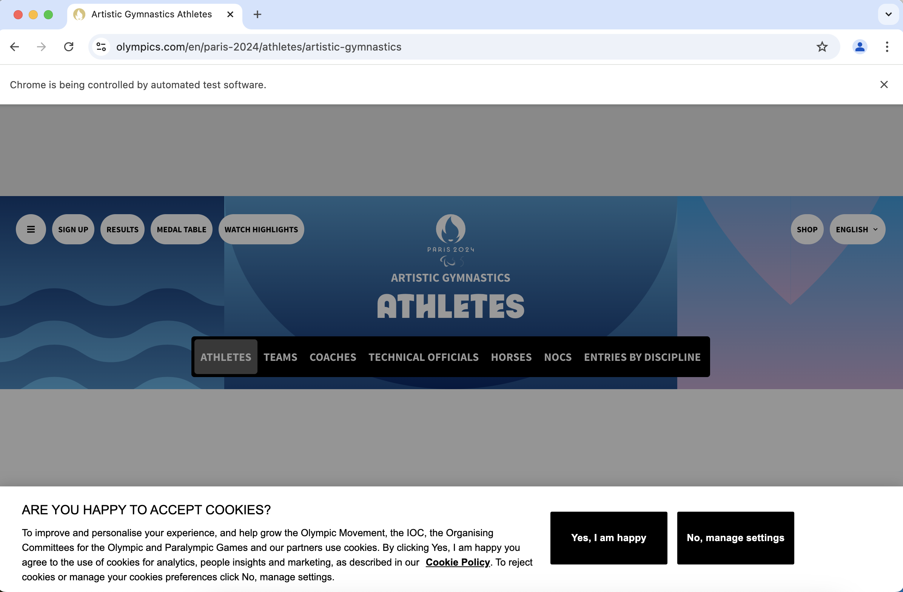
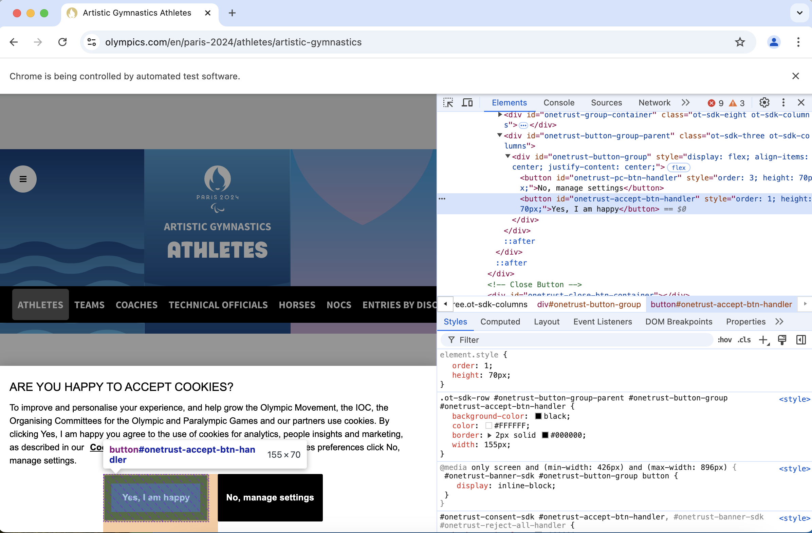
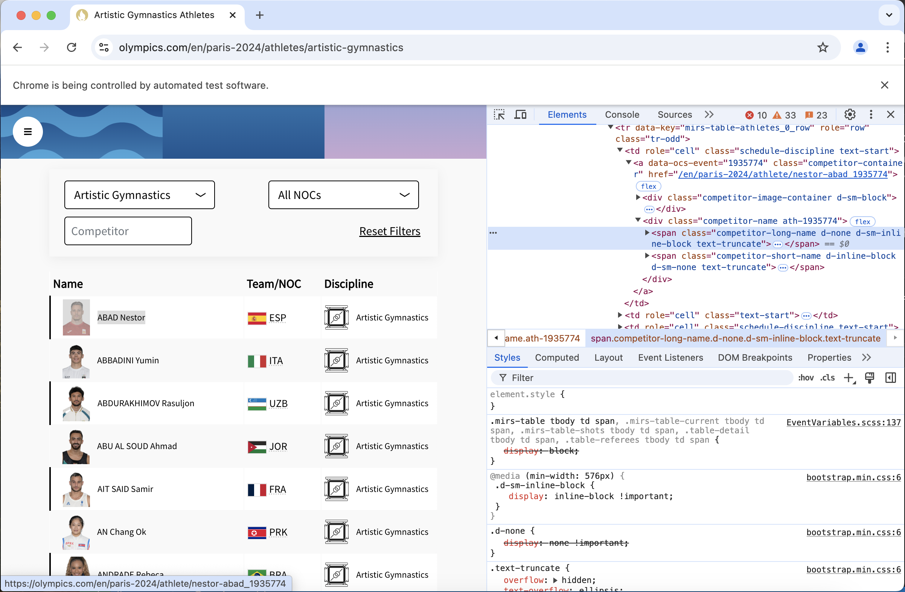

# Data Jamboree 2024
Julia code for the ASA computing section mini-symposium data jamboree. 

## Intro
Full disclosure, this was my first time webscraping in `Julia`, so I'm sure that my solution could be a little more elegant.
In this demo - we deal with two different types of websites, dynamic and static.
For dynamic sites we need a web driver in order to interact with the website through code.
This allows the different scripts on the website to run, after which we can then scrape the compiled html. 

In Julia we have two options of packages: `Blink` which is a wrapper for `Electron` and can communicate to the browser through JavaScript.
I was not able to get the [olympics](https://olympics.com/en/paris-2024/athletes/artistic-gymnastics) website to load in Blink (other websites did load) so I did not spend too much time messing with with the package.
Additionally, for `Blink` you pass JavaScript code to the web driver which is a little more complicated than using the wrapper functions from a web driver package (though may be easier if you are familiar with `JavaScript`).

The second option is `WebDriver`, a wrapper for Selenium and should be very familiar to those who have used the `webdriver` package in Python. [^1] 
This is the package that I use in the demo. 
[The documentation](https://nosferican.github.io/WebDriver.jl/dev/) is rather sparse, but there is a nice tutorial for web automation using `WebDriver` in Julia [here](https://www.youtube.com/watch?v=KWYNlIOxQpo).
While `WebDriver` accomplishes everything we need for this demo, the package is more lightweight than the correpsonding `Python` package.
Using the `WebDriver` package requires a web driver application and following the linked tutorial I also use `chromedriver`. You can select a different web driver if you prefer.

For static websites we use the `HTTP` [[docs]](https://juliaweb.github.io/HTTP.jl/stable/) package to scrap the html, `Gumbo` [[github]](https://github.com/JuliaWeb/Gumbo.jl) to parse the html into a structured object which can then be easily indexed by the tree structure of the html code.
Lastly, the `Cascadia` [[docs]](https://docs.juliahub.com/Cascadia/Pq6Fi/1.0.2/) package can extract elements from the html using css selectors.
[Here](https://www.youtube.com/watch?v=qv7M5oBZPWE) is a tutorial for these three packages. 

[^1]: There is another `WebDriver` package out there which is deprecated. Some tutorials on YouTube use this older package which has different functions.

## Getting Started
In the chunk below we create a virtual environment with `Pkg.activate(@__DIR__)` and install all the required packages  with `Pkg.instantiate()`.
```julia
using Pkg

Pkg.activate(@__DIR__)
Pkg.instantiate()
```

```julia
using HTTP, Gumbo, Cascadia # for static webscraping
using WebDriver, DefaultApplication # for remote control of a website
using ProgressBars
using DataFrames, CSV, PrettyTables
using Plots, StatsPlots
using StatsBase
```

## Web Driver
First we need to set up our webdriver. We can open the webdriver with `DefaultApplication` or go to the terminal and start `chromdriver`.
When we start `chromedriver`, it will specify which port the application is using. We will need this to start our web driver session. 

```julia
DefaultApplication.open("chromedriver") 
```

The `RemoteWebDriver` function requires three arguments: capabilities, which specifies which browser you are using, the host and the port, which is printed to the terminal when we start up `chromedriver`. 
(I'm sure you could fully automate this by starting up chromedriver on a specified port all from `Julia`, but this works for here)

```julia
capabilities = Capabilities("chrome")

wd = RemoteWebDriver(
  capabilities,
  host = "localhost",
  port = 55130 # replace this with the correct port
)

session = Session(wd)
```

### Navigating through and scraping the athletes names webpage
Before we create a function to get all the athletes, we will figure out how to navigate through the webpage through the webdriver.
This essentially boils down to inspecting the website to find the appropriate tag for the buttons that we want to click, using the tag (css selector, xpath, etc.) to find the element through code, then clicking the button with code. For each page that we are on, we can scrape the source html with the parse `parsehtml` function from `Gumbo` and then extract the elements that we want using css selectors and the `Cascadia` package. 

Lets start with [artistic gymnastics](https://olympics.com/en/paris-2024/athletes/artistic-gymnastics).
With our session already up, we can navigate to the url with `navigate!`.

```julia 
url = "https://olympics.com/en/paris-2024/athletes/artistic-gymnastics"
navigate!(session, url)
```
The accept cookies pops up first:


We can inspect the element (right click and select inspect on Mac) to find a tag for the accept cookies button:

Here we see the the css selector is `#onetrust-accept-btn-handler` (`#` is for the id). 
We find this element with the `Element` function from `WebDriver` and 'click' the element with `click!`.
```julia
cookies_button = Element(session, "css selector", "#onetrust-accept-btn-handler")
click!(cookies_button)
```
Note that here we use a css selector, but we can use other tags such as an xpath to identify the element.
Later on when we use `Cascadia`, we can only use css selectors. 

Now we are at the page with the athletes listed.
Inspecting the name portion of the table we can find the appropriate tag to identify the athlete names.

We will now switch to `Gumbo` to parse the rendered html and use `Cascadia` to scrape all the athlete names:
```julia
html = parsehtml(source(session))
body = html.root[2]
matches = eachmatch(Selector("span.competitor-long-name"), body)
```
We source the rendered html from our session and parse with `parsehtml`. 
The body of the html is the second element of the root of the parsed html (the header is the first element of the root). 
The `eachmatch` function from base `Julia` works with the `HTMLElement{:HTML}` class by wrapping a css selector with the `Selector` function and returns each matched html element in a vector.
A *single match* will return a vector of length 1. 
We selected the html element that just contains the name of the athlete, so all that is left to do is extract the text of the html element which we can do with the function `nodeText()`.
```julia
athlete_names = Vector{String}()
for item ∈ matches
  push!(athlete_names, nodeText(item))
end
```
This only gives us the first 50 athletes, so we need to navigate to the next page button and click it to bring up the next page of athletes.
Following the same process as before we inspect the element to find the appropriate tag. Find the element with our code and click it.
```julia
next_button = Element(session, "css selector", "div.mirs-pagination-right > button:nth-child(2)")
click!(next_button)
```

Now we can put these elements together to create a function to scrape all the athletes from a single sport.
The urls are consistent so we can append the base url with the sport name
```julia
url = "https://olympics.com/en/paris-2024/athletes/" * sport
```
After we navigate to the webpage, we want the the system to sleep so the webpage has time to render the html completely before we try to click any buttons (or scrape data).
```julia
navigate!(session, url)
sleep(sleep_time)
```
We only need to click the cookies button once, so we throw it into a try-catch statement so our function doesn't break when the cookies button doesn't appear. 
```julia
try 
  click!(cookies_button)
catch
end
```
In order to move to the next page button, we can use the `moveto!` function.
We need the button to be in the view of the webdriver so otherwise the click command won't work.
Moving to the next page button didn't work very well so I found the tag for the box around the next page buttons which seemed to work better. 
A single execution of `moveto!` didn't always navigate to the box, so I threw it into a for loop to help the web driver *really* navigate to the button. 
```julia
box = Element(session, "css selector", "div.mirs-pagination-right")
sleep(sleep_time)
for _ ∈ 1:3
  moveto!(box)
  sleep(sleep_time)
end
```
Lastly, we want to keep navigating and scraping athlete names as long as the next page button is enabled. We will break out of a while loop after we scrape the final page and check with `isenabled(next_button)` returns `false`. 
```julia
function get_athlete_names(sport, session, sleep_time=1)
  url = "https://olympics.com/en/paris-2024/athletes/" * sport
  navigate!(session, url)
  sleep(sleep_time)

  cookies_button = Element(session, "css selector", "#onetrust-accept-btn-handler")
  try 
    click!(cookies_button)
  catch
  end
  println("Webpage Loaded")

  athlete_names = Vector{String}()
  box = Element(session, "css selector", "div.mirs-pagination-right")
  sleep(sleep_time)
  for _ ∈ 1:3
    moveto!(box)
    sleep(sleep_time)
  end
  while true
    html = parsehtml(source(session))
    matches = eachmatch(Selector("span.competitor-long-name"), html.root[2])
  
    for item ∈ matches
        push!(athlete_names, nodeText(item))
    end

    next_button = Element(session, "css selector", "div.mirs-pagination-right > button:nth-child(2)")
    if isenabled(next_button)
      click!(next_button)
      sleep(sleep_time)
    else 
      break 
    end
  end
  
  unique!(athlete_names)
end
```

### Scrape all athletes from our 6 sports
Next we loop through the 6 sports that we want to scrape names for and save the results in a `DataFrame`.
```julia
# Vector of all sports pages we want to scrape
sports = ["artistic-gymnastics", "football", "swimming", "volleyball", "basketball", "athletics"]

# Loop through and scrape all sports pages
n_athletes = Vector{Int}()
athlete_name = Vector{String}()
for s ∈ sports
  out = get_athlete_names(s, session)
  append!(athlete_name, out)
  push!(n_athletes, length(out))
end

# save into a DataFrame
df = DataFrame(athlete_name=athlete_name,
  sport = reduce(vcat, fill.(sports, n_athletes)),
  wiki_name = "",
  month = 0
)
```
Since we are finished with our webdriver, we can close the session with
```julia
delete!(session)
```
## Scrape Birth Month from Wikipedia Pages
### Reformat names into wikipage format.
Currently the names are in the format `FAMILY NAME Given Name`. We need them in the format `Given_Name_Family_Name` to access the wikipedia page for each athlete. 
We will split our name string by the first space that is followed by a title case word with the regular expression `r"(\s)(?=[A-Z][a-z]+)"`. 
[This](https://regexr.com) is my go to website to build and test regular expressions, it is quite useful as it explains each element of the regex. 
The limit option in the `split` function, limits the size of the output vector to length 2, thus we will only split at the first space followed by a title case word, rather than split at every space followed by a title case word.
We reorder the names and convert to title case and replace all spaces with unerscores.
If the athlete does not have a given name (i.e. title case name listed), we just convert the family name to title case. 
```julia
for i ∈ 1:nrow(df)
  split_name = split(df[i,:athlete_name], r"(\s)(?=[A-Z][a-z]+)"; limit=2)
  if length(split_name) == 2
    df[i,:wiki_name] = replace(split_name[2] * "_" * titlecase(split_name[1]), " " => "_")
  else
    df[i,:wiki_name] = titlecase(split_name[1])
  end
end
```

### Scrape birth months
We will write a function to modify our `df` with the athelete's birth month from wikipedia if we can successfully load athlete's the page.
The athlete names from the olympics page do not contain hyphens, special characters, or additional tags wikipedia uses to disambiguate persons (e.g. Liu Yang the gymnast from the Liu Yang the taikonot or Liu Yang the violinist), so our reformatting of the name will not successfully find the wiki page for quite a few athletes. 

With our reformatted names we get the html with `HTTP.get`
and then parse.
```julia
url = "https://en.wikipedia.org/wiki/" * df[i,:wiki_name]
html = HTTP.get(url)
parsed = parsehtml(String(html))
```
The output from `HTTP.get` is in binary, so we need to convert it to text first with `String`.

Inspecting the birthday element, we can see that there is a hidden element with the birthday in YYYY-MM-DD format, which will be much easier to work with.

This element conveniently has the css class 'bday'.

After we extract the birthday string, we use the regular expression `r"(?<=-)[0-9]{2}(?=-)"` to find the two digits preceded  and followed by a `-` and convert the two digit string to an `Int`.
```julia
# function to scrape the birth month from the wikipedia page
function get_athlete_birth_month!(df)
  n = size(df,1)
  for i ∈ ProgressBar(1:n)
    url = "https://en.wikipedia.org/wiki/" * df[i,:wiki_name]
    try 
      html = HTTP.get(url)
      parsed = parsehtml(String(html))
      date_string = eachmatch(Selector("span.bday"), parsed.root)[1] |>
        nodeText
      df[i,:month] = parse(Int64, match(r"(?<=-)[0-9]{2}(?=-)", date_string).match)
    catch
    end
  end
end
```

After we scrape the birth months from the individual wikipedia pages, we create a column for the sport type, filter out the athletes for whom we could not load their wiki page and save the data frame. 
```julia
get_athlete_birth_month!(df)

# Create column for sport type (team or individual)
df[:,:sport_type] = ifelse.(df.sport .∈ (["football", "volleyball", "basketball"],), "team", "individual")

# filter out athletes who we were not able the scrape their birth month
filter!(:month => !=(0), df)

# save intermediate results
CSV.write("athlete_df.csv", df)
```

## Analysis
Onto the analysis portion of the jamboree task: 
```julia; results = "hidden"
df = CSV.read("athlete_df.csv", DataFrame)
```

For the team sports and individual sports we create a table of the number of athletes born in each month.
We compute the relate frequency and merge the tables together for an easy comparison of the relative frequencies.
```julia
ind = combine(groupby(df[df.sport_type .== "individual",:], :month), nrow => :count)
team = combine(groupby(df[df.sport_type .== "team",:], :month), nrow => :count)

ind.rel_freq = ind.count ./ sum(ind.count)
team.rel_freq = team.count ./ sum(team.count)

both = innerjoin(ind, team, on=:month, makeunique=true)
select!(both,[:month, :rel_freq, :rel_freq_1])
rename!(both, ["Month", "Individual", "Team"])

pretty_table(both, backend=Val(:markdown), formatters=ft_printf("%5.3f", [2,3]))
```
| **Month**<br>`Int64` | **Individual**<br>`Float64` | **Team**<br>`Float64` |
|---------------------:|----------------------------:|----------------------:|
| 1                    | 0.100                       | 0.084                 |
| 2                    | 0.079                       | 0.091                 |
| 3                    | 0.085                       | 0.072                 |
| 4                    | 0.079                       | 0.081                 |
| 5                    | 0.090                       | 0.089                 |
| 6                    | 0.082                       | 0.089                 |
| 7                    | 0.080                       | 0.108                 |
| 8                    | 0.085                       | 0.086                 |
| 9                    | 0.088                       | 0.072                 |
| 10                   | 0.082                       | 0.076                 |
| 11                   | 0.075                       | 0.084                 |
| 12                   | 0.074                       | 0.069                 |

I am more of a visual person, so also created some bar plots.
```julia
p1 = bar(ind.month, ind.rel_freq, yaxis="Relative Frequency", legend=false, title="Individual")
p2 = bar(team.month, team.rel_freq, legend=false, title="Team")
plot(p1,p2, xaxis="Month", layout=(1,2))
```
I wouldn't draw any strong conclusions from an exploratory look from the data though, for individual sports, it looks like there are more athletes born in January (the oldest in their age category). For the team sports it appears that there are more athletes born in July. At least in the United States, July is an odd cutoff, I would have expected August or September as the cutoff for team sports to align with the school year.  
<br>
I expect different team sports use different age cutoffs across different countries, whereas individual sports may be more consistent using a Jan 1st cutoff. Fun comparison none the less, worth spouting out as a fun fact at a dinner party, but not one I'd place any monitary value on if I were making a bet.